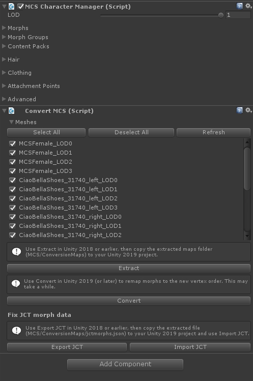

# MCS Converter
This converter remaps the morphs of the MCS avatar system (v1.7) so they will work with Unity 2019 and later. 

## The issue.
Unity introduced a new way of optimizing mesh on import, which scrambles the vertex order of the MCS models. However, the MCS morph targets will still have the old vertex order, so when applying a morph the wrong vertices get pushed and you end up with some abstract art.
This tool converts the morph target maps to their new vertex order.

# Installing
1. Create TWO Unity projects: one in version that works with MCS 1.7 (i.e. 2017 or 2018), and one in your later version (2019+). Apply the following steps to both projects.
2. From <https://github.com/mcs-sdk/mcs/releases>, download and import your MCS packages. The CodeAndShaders.unitypackage and the female or male base package are mandatory; add whatever additional clothing/hair packs you have and need.
3. Import the MCSConverter.unitypackage included in this repo, or drag and drop the RadboudVR folder into your Assets folder.
4. Drag the MCSFemale or MCSMale prefab into your scene. 
5. Attach your content packs
6. Add the ConvertMCS.cs component to the MCS character.

# Usage
In your Unity 2017/2018 project:
1. Select the meshes you wish to convert (default selects all)
2. Click "Extract". This will extract vertex maps of all selected models into a file folder.
3. Copy the extracted maps folder (Assets/MCS/ConversionMaps) into the same location in your Unity 2019+ project.

In your Unity 2019+ project:
1. Select all meshes you wish to convert.
2. Click "Convert". This may take a while and will overwrite the old morph streamingasset files.
3. Restart Unity.

# Limitations
While this converts all the morph maps, the MCS 1.7 system also relies on a "JCT manager" for some morphs that has its own mapping. I have not yet figured out how to remap those, so if you run into any  issues, try disabling the JCT Transition component on the hip of your MCS character.